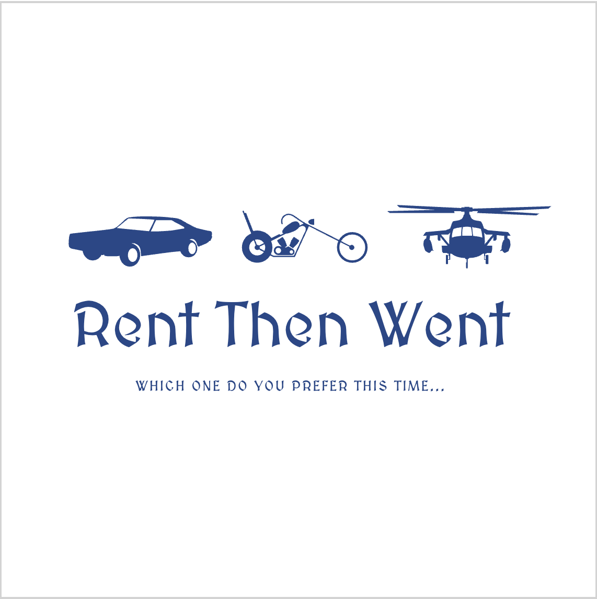

<div align="center">
  

  <h1>🚗 Rent Car Project</h1>

  <p style="max-width:650px; margin:auto; text-align:center;">
    <strong>Rent Car Project</strong> is a comprehensive application designed to simplify vehicle management and tracking.  
    It allows you to store vehicle data, manage users, and perform various fleet-related operations efficiently.
  </p>
</div>

---

## 📘 Table of Contents
- [Project Overview](#project-overview)
- [Features](#features)
- [Architecture](#architecture)
- [Project Structure](#project-structure)
- [Requirements](#requirements)
- [How to Build & Run](#how-to-build--run)
- [Sample Commands](#sample-commands)
- [Testing](#testing)
- [Docker Support](#docker-support)
- [Badges](#badges)
- [Contact](#contact)

---

## Project Overview
**Vehicle Rental Project** is an extendable and modular vehicle management system that can be used for car rental, fleet management, or asset tracking purposes.  
The system provides features such as JSON-based data storage, user authorization, and a simple command-line interface for direct interaction.

---

## Features
- 🚘 **Vehicle Management:** Add, update, or delete vehicles  
- 🔧 **Technical Tracking:** Monitor vehicle specifications and service history  
- 👥 **User & Role Management:** Manage administrators and regular users with different privileges  
- 💾 **Persistent Storage:** Data stored in JSON files for easy access and backups  
- 💻 **CLI Interface:** Clean and user-friendly command-line interface  
- 🧱 **Modular Design:** Easy to extend and maintain  

---

## Architecture
The project follows a **layered architecture** to separate logic and improve maintainability:

| Layer | Description |
|-------|--------------|
| **Model Layer** | Contains domain objects such as `Vehicle`, `User`, and `Price`. |
| **Service Layer** | Handles business logic and validation. |
| **Repository Layer** | Manages data persistence through JSON files. |
| **CLI Layer** | Provides a text-based interface for interaction. |

---

## Project Structure
RentCarProject/

│
├── rentacar/
│ ├── src/
│ │ ├── main/java/com/Rent/
│ │ │ ├── model/ # Data models (Vehicle, User, Price)
│ │ │ ├── service/ # Business logic
│ │ │ ├── repository/ # JSON data management
│ │ │ └── cli/ # CLI interface and utilities
│ │ └── resources/ # Configuration & JSON files
│ └── pom.xml # Maven project file
│
├── data/
│ ├── vehicles.json
│ └── users.json
│
└── README.md

---Ï

## Requirements
Make sure you have the following installed:

| Requirement | Version / Description |
|--------------|-----------------------|
| **Java** | 24 (OpenJDK or Oracle JDK) |
| **Maven** | 3.9+ |
| **Jakarta / Gson** | 3.1 |

---

## How to Build & Run

### 1️⃣ Open the terminal
### 2️⃣ Navigate to the project directory
```bash
cd path/to/your/RentCarProject/rentacar
```
```bash
mvn clean install
```

```bash
mvn exec:java
```

```bash
java -jar target/Rent-car-project.jar
```
🛠️ Badges
<p align="center">     </p>

## 📫 Contact

For questions, suggestions, or contributions, feel free to reach out:
📧 sarperkaya@sarperkaya.site
